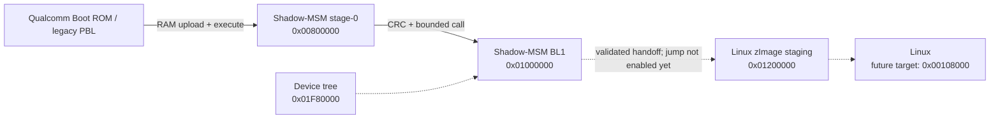

# Shadow-MSM

[](https://www.gnu.org/licenses/gpl-3.0)


**RAM-first bare-metal bring-up and Linux boot research for legacy Qualcomm
MSM hardware.**

Shadow-MSM currently targets the **ZTE/Vodafone K3765-Z**, built around the
Qualcomm MSM6290. The project provides a reproducible path from the legacy
Qualcomm primary downloader to custom ARM code, a diagnostic stage-0 monitor,
and a small second-stage bootloader—without modifying NAND.

> [!IMPORTANT]
> Linux is **not booting yet**. Custom ARM code, the stage-0 monitor, RGB LED
> control, runtime hardware identification, and BL1 0.1 are verified on real
> hardware. BL1 0.2's non-jumping Linux handoff dry run is built and statically
> checked, but still awaits its target-side test.

## Why this exists

The MSM6290 predates modern Sahara and Firehose workflows. Public documentation
and mainline Linux support are scarce, while vendor tools assume a Windows
flashing environment and provide little visibility into the boot process.

Shadow-MSM takes a deliberately conservative approach:

- execute experimental code from SDRAM;
- keep the original boot chain and NAND contents intact;
- verify every uploaded image with a target-side CRC before calling it;
- log every command, address, result, and observed reset;
- establish observable hardware checkpoints before attempting a kernel handoff.

## Verified target

| Component | Identification |
|---|---|
| Device | ZTE/Vodafone K3765-Z |
| Firmware family | `BD_VDFP673A1V1.0.0B04` |
| SoC | Qualcomm MSM6290 |
| CPU | ARM926EJ-S r0p5, ARMv5TEJ |
| CPU MIDR | `0x41069265` |
| RAM | 32 MiB address window |
| NAND | Hynix `H8ACS0PL0MCR`/`HSACS0PL0MCR` profile |
| NAND geometry | 128 MiB data + 4 MiB OOB |
| PMIC family | Qualcomm PM6658 |
| Stock runtime | Qualcomm AMSS over OKL4/Quartz |

The stock AMSS image maps physical memory from `0x00100000` through
approximately `0x01F5A000`. Shadow-MSM has also executed with a private stack
at `0x01FFF000`, confirming usable RAM near the top of the 32 MiB window.

## Current achievements

- [x] Extracted and mapped the exact OEM firmware package
- [x] Recovered the matching legacy ARM programmer
- [x] Entered the pre-Sahara downloader without performing an upgrade
- [x] Verified legacy PBL RAM-write command `0x0F`
- [x] Verified PBL execute command `0x05`
- [x] Executed custom ARMv5 code entirely from RAM
- [x] Established a stable USB diagnostic stage-0 monitor
- [x] Added runtime CP15/system-register queries
- [x] Added bounded target-side CRC32 verification
- [x] Added bounded second-stage calls with controlled `r0`–`r2`
- [x] Identified and controlled all RGB LED channels
- [x] Built and hardware-tested BL1 0.1 with boot logs and system information
- [x] Built BL1 0.2 Linux-handoff validation and a minimal device tree
- [ ] Verify BL1 0.2 dry run on the target
- [ ] Establish an independent post-handoff UART or USB console
- [ ] Add MSM6290 timer and interrupt-controller support
- [ ] Reach the first Linux decompressor/kernel banner
- [ ] Boot a built-in BusyBox initramfs
- [ ] Add microSD, NAND read-only, USB gadget, and display support

## Boot architecture



The stage-0 monitor is based on the initialized OEM ARM programmer runtime so
the known USB diagnostic transport remains available. BL1 uses its own stack,
prints hardware and CP15 state, and currently returns cleanly to stage-0.

## RAM layout

| Address range | Purpose |
|---|---|
| `0x00100000..0x007FFFFF` | Future decompressed Linux region |
| `0x00800000..0x00819DC7` | RAM-only stage-0 monitor |
| `0x01000000` | BL1 load and entry |
| `0x01200000..0x01EFFFFF` | zImage staging window, 13 MiB maximum |
| `0x01F80000..0x01F8FFFF` | Reserved DTB window |
| `0x01FFF000` | BL1 private stack top |
| `0x02000000` | End of the 32 MiB RAM window |

See [the detailed layout](outputs/K3765_LINUX_RAM_LAYOUT.md).

## Repository layout

```text
Shadow-MSM/
├── README.md
├── LICENSE
├── CHECKSUMS.sha256
├── requirements.txt
├── firmware/
│   └── README.md
├── work/
│   ├── firmware-analysis utilities
│   └── stage-0 / BL1 image builders
└── outputs/
    ├── RAM-only host tools and generated images
    ├── disassembly and address maps
    ├── BL1_README.md
    ├── BL1_0.2_DRYRUN_README.md
    └── TEST_LOG.md
```

The complete chronological evidence trail is in
[`outputs/TEST_LOG.md`](outputs/TEST_LOG.md).

## Requirements

The current development host is Windows. The tools require:

- Python 3.9 or newer;
- [`pyserial`](https://pypi.org/project/pyserial/);
- [`capstone`](https://pypi.org/project/capstone/);
- [`keystone-engine`](https://pypi.org/project/keystone-engine/);
- the correct Windows serial driver for the legacy ZTE downloader interface;
- a legally obtained copy of the matching K3765-Z stock updater.

Install the Python dependencies:

```powershell
py -3.9 -m pip install pyserial capstone keystone-engine
```

## Prepare the OEM-derived runtime locally

The repository intentionally does not contain `armprg.bin` or a patched
stage-0 image. Extract the matching programmer from a legally obtained stock
updater and place it at:

```text
firmware/armprg.bin
```

The builder verifies its size and SHA-256 before making any output. Build the
RAM-only stage-0 monitor with:

```powershell
py -3.9 .\work\build_armprg_stage0_monitor.py
```

This produces the locally ignored `outputs/armprg_stage0_monitor.bin`. See
[`firmware/README.md`](firmware/README.md) for the accepted source hash.

## Safe quick start: verified BL1 0.1

Start from a fresh legacy downloader session. Replace `COMxx` with the active
downloader port:

```powershell
py -3.9 .\outputs\k3765_stage0_load.py COMxx `
  .\outputs\armprg_stage0_monitor.bin `
  .\outputs\k3765_stage2_bootloader.bin `
  --log .\outputs\bl1_load.log
```

Verify the image in target RAM before executing it:

```powershell
py -3.9 .\outputs\k3765_stage0_console.py COMxx `
  crc 0x01000000 2861
```

Expected:

```text
CRC32: 0xEFF2DC54
```

Run BL1:

```powershell
py -3.9 .\outputs\k3765_stage0_console.py COMxx `
  boot 0x01000000 0xA0A0A0A0 0xB1B1B1B1 0xC2C2C2C2 `
  --log .\outputs\bl1_boot.log
```

Expected final result:

```text
RETURN R0: 0x424F4F54
```

`0x424F4F54` is ASCII `BOOT`. After execution, the BL1 CRC changes to
`0x83FFF9DF` because its 13-byte hexadecimal formatting buffer contains the
last printed value, `0xC2C2C2C2`; the executable code is unchanged.

## Linux-handoff dry run

BL1 0.2 validates a header-only zImage fixture and a minimal flattened device
tree, prints the planned Linux entry registers, and returns `DRY1` without
jumping.

The complete commands, CRCs, and expected output are documented in
[`outputs/BL1_0.2_DRYRUN_README.md`](outputs/BL1_0.2_DRYRUN_README.md).

SHA-256 values for the redistributable generated artifacts are recorded in
[`CHECKSUMS.sha256`](CHECKSUMS.sha256).

## RGB diagnostic LED

The K3765-Z multicolor LED is useful as an early bring-up console:

| Color | Control path |
|---|---|
| Red | PMIC MPP current sink 1 |
| Green | PMIC LED channel 0 |
| Blue | PMIC LED channel 1 |
| Cyan | Green + blue |
| White | Red + green + blue |

LED checkpoints can remain available after the resident USB transport is
discarded during a future non-returning Linux handoff.

## Safety model

Shadow-MSM is designed around volatile experimentation:

- current loaders write only to the bounded SDRAM window;
- current payloads do not contain NAND erase or program implementations;
- BL1 does not link or call the OEM NAND routines;
- power-cycling removes the experimental code and restores the stock boot path;
- target-side CRC verification is required before a second-stage call.

This is experimental low-level software. A coding error can still hang or reset
the target. Use only hardware you own, preserve the original updater and
backups, and inspect every command before running it.

Do **not** substitute QPST's *User Partitions* workflow for these RAM-only
commands. In Qualcomm terminology that screen performs host-to-device writes.

## Firmware and redistribution

Shadow-MSM does not grant permission to redistribute Qualcomm, ZTE, Vodafone,
or other vendor firmware. Stock updaters, firmware images, identifiers, and
device dumps remain subject to their original terms.

Keep vendor files outside the public repository. Prefer build scripts that
patch a user-supplied, hash-verified stock image locally instead of committing
vendor-derived binaries.

Qualcomm, ZTE, Vodafone, Hynix, ARM, and other names are trademarks of their
respective owners. Shadow-MSM is an independent research project and is not
affiliated with or endorsed by those companies.

## Contributing

Contributions are welcome, especially:

- confirmed MSM6246/MSM6275/MSM6280/MSM6290 register information;
- UART pin-mux and test-pad identification;
- timer, interrupt-controller, clock, GPIO, and USB documentation;
- reproducible logs from closely related devices;
- small ARMv5-compatible Linux drivers;
- review of cache, MMU, and kernel-handoff code.

Please preserve the RAM-first default, document the exact hardware and firmware
revision used, include hashes and target logs, and clearly label anything that
has not been tested on physical hardware.

## License

The original Shadow-MSM source code and documentation are licensed under the
**GNU General Public License version 3 only** (`GPL-3.0-only`).

The GPL does not apply to third-party firmware, drivers, trademarks, or dumps
merely used with the project. See the
[GNU GPL version 3](https://www.gnu.org/licenses/gpl-3.0.html) for the complete
license terms.
